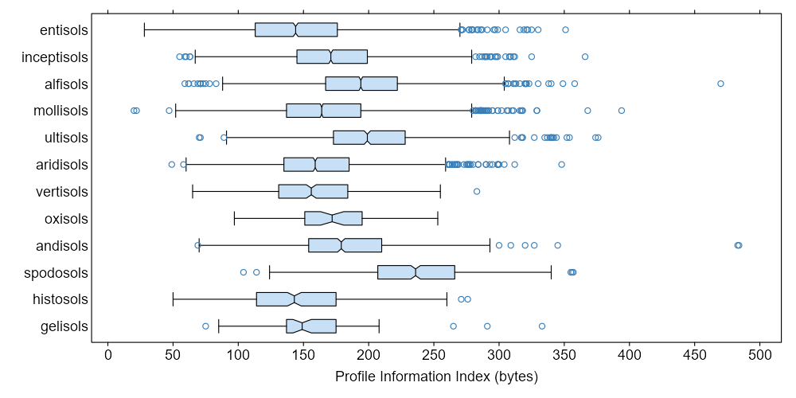
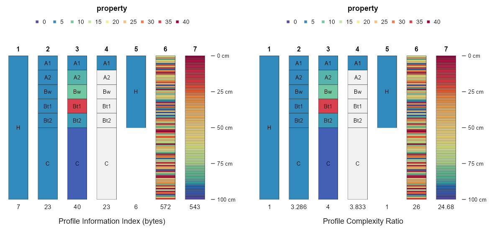
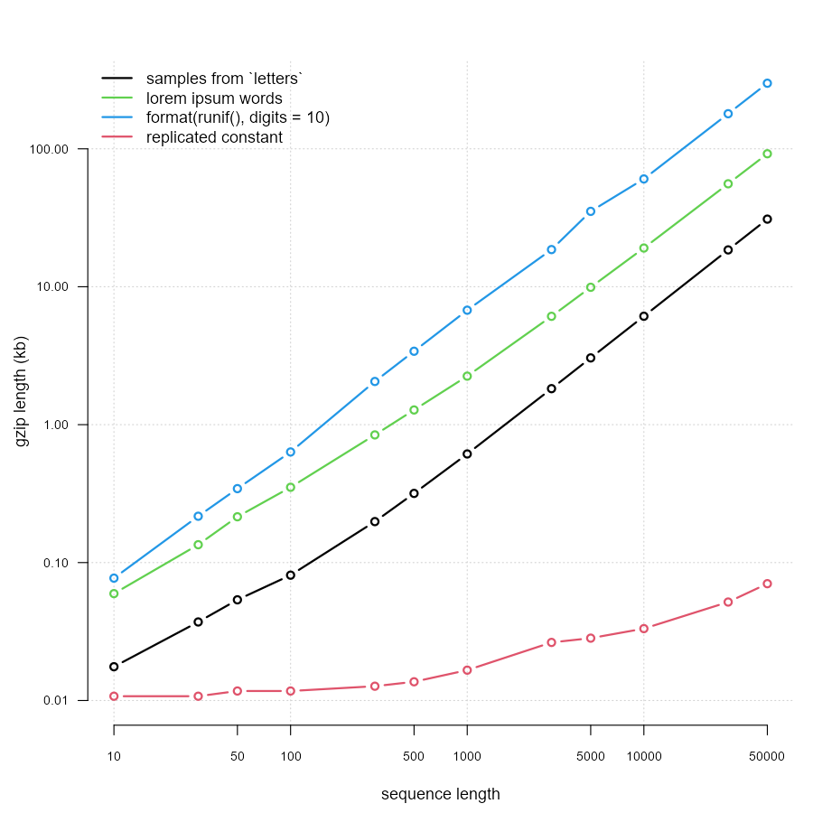
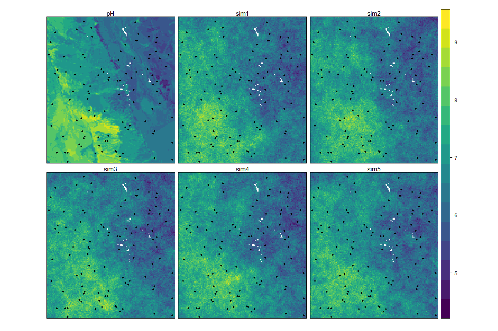
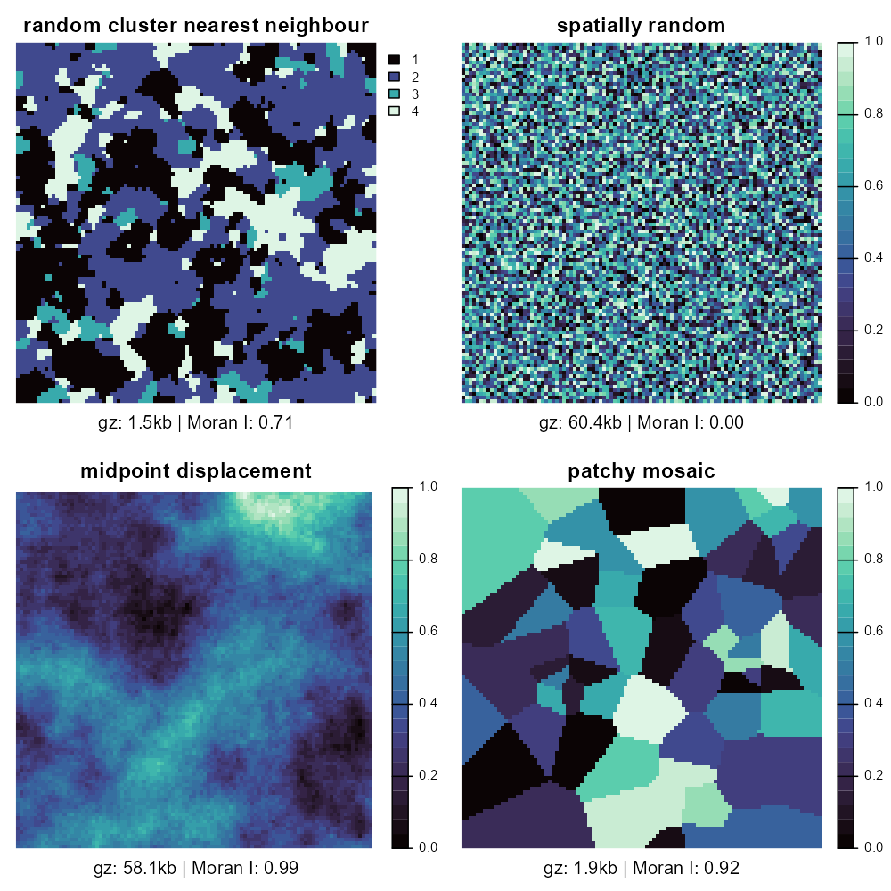
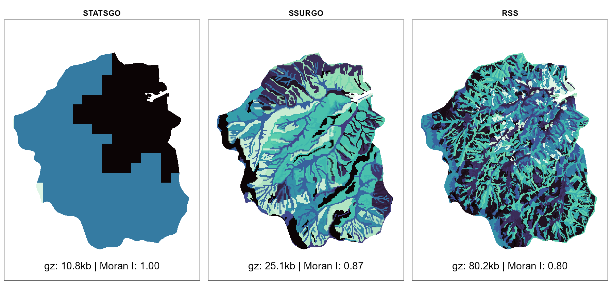
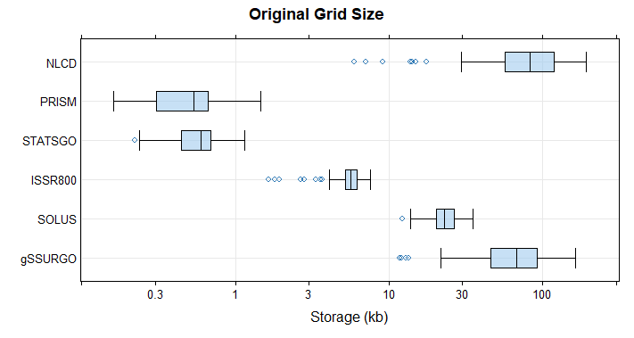

# Thesis
Blah blah blah... I've tried to apply entropy, "information content", "redundancy" and similar ideas to the field of soil genesis and geography.

In particular, is the application of Shannon Entropy for the description of "conceptual purity", "conceptual precision", or perhaps "generalization". I'm trying to craft a more robust definition or description for "conceptual precision" to pin-down methods used in soil survey. 

For example, in cartography there are various levels of generalization (map scale) that can be used to "map" the coastline of Great Britain; several possible scales are applicable to different tasks. The same can be done with soil mapping: tighter delineations in areas where e.g. farming is more expensive or where fertilizer inputs must be more tightly controlled. "Conceptual precision" applies to the attributes of a map unit (those soils contained within), and can be allowed to vary based on the level of investigation: "soup to nuts" -- "these three distinct soils" -- "primarily this one soil". Given the constraints of soil survey budgets and the inherent spatial variability of soils, there is always a tradeoff between spatial precision (minimum resolvable area) and conceptual precision (specificity of the attached soil data). I'd like to develop some language / methods to better define this tradeoff. I think that information theory is the key.

Another, related idea has to do with a description of soil variability (complexity?) using information theory. In this case, via gzip compression. For example, a ranking of soil data via gzip compression size (larger values = more "complex").

# Resources

https://scottaaronson.blog/?p=762

"One could try to show such a statement either theoretically or empirically.  Theoretically, I have no idea where to begin in proving it, despite a clear intuition that such a statement should hold: let me toss it out as a wonderful (I think) open problem!  At an empirical level, one could simply try to plot the complextropy in some simulated system, like the discrete coffee cup, and show that it has the predicted small-large-small behavior.   One obvious difficulty here is that the complextropy, under any definition like the one I gave, is almost certainly going to be intractable to compute or even approximate.  However, one could try to get around that problem the same way many others have, in empirical research inspired by Kolmogorov complexity: namely, by using something you can compute (e.g., the size of a gzip compressed file) as a rough-and-ready substitute for something you can't compute (e.g., the Kolmogorov complexity K(x))."

https://jakubnowosad.com/iiasa2023/#/title-slide

IPA concept:
  * https://iopscience.iop.org/article/10.1088/1748-9326/abbb00/pdf
  * https://www.publish.csiro.au/sr/pdf/SR9760291

Information Theory as applied to color science (?), note use of sRGB color coordinates and lack of CIE2000:
https://derivativedribble.wordpress.com/2018/11/21/using-information-theory-to-explain-color-perception/

https://opg.optica.org/josaa/abstract.cfm?uri=josaa-29-12-2557

# To-Sort

## Dylan:
After our last discussion I made some changes to the application of "information content as approximated by gzip compression" to soil profile data. I then applied it to about 23,000+ "official series descriptions"—these are our templates for generic soil types used in our soil survey. A couple of patterns were nice to see:

Roughly normal distribution of PII across ~23k soils

There are fairly intuitive patterns across multiple levels of Soil Taxonomy.
  
  * spodosols are some of the most complex soils we classify with many horizons, highly contrasting properties and colors with depth, and often very deep
  
  * entisols are characterized by very little soil development, with fairly similar soil properties over depth
  
  * ultisols / alfisols are somewhere in between

I'd really like to see information theory applied to the following topics of interest to soil survey and soil science:

  * as an index of soil development, within-system entropy, and perhaps as a clue about where a soil might be along a trajectory of soil genesis
  * an index of conceptual precision or scale via information content of tabular records describing the collection of soil types within a mapping unit
  * an index of spatial precision or scale via information content of gridded maps per unit area

I still have yet to read through your dissertation (looking forward to it), but have not let these ideas completely leave my mind. I recently realized that pushing data through gzip is a little more complex than first expected. Dealing with NA, converting everything to fixed-precision character representation, etc.. This gets a little more complicated when dealing with soil profile data structures or gridded predictions from a spatial model.

Here are a couple examples, applied to soil profile data. The "Profile Complexity Index" is the total amount of storage after restructuring the data to 1cm slices, removal of NA, and gzip compression. The Profile Complexity Ratio is the ratio of gzip compressed size / gzip compressed size of a "simplified" representation. In this case, "simplified" means mean of numeric data and most frequent of categorical data. A single numeric property and the horizon names are considered.

Profile #6 is made up of uniform random values, profile #7 is a sorted version of #6.

We don't have to use gzip, but its ubiquitous use and availability makes it an ideal candidate. I too wonder about the relationship between "information" ~ gzip size. Is it continuous? We would need some detailed investigation to be sure, maybe even consulting with a CS expert. Simple experiments in R via memCompress() are helpful, but I'd rather not have to reverse-engineer it.

gzip will work on any data source that can be represented as text or raw bytes. Check this out:

This tracks intuition and the curves appear continuous. Note log-log scales.

The space between "red" (single replicated value) and "blue" (uniform noise) represents the possible domain over which "information", "complexity", etc. can be described. I think. R code attached.

As for the last question about "preserving meaning", that is a tough one. It is lossless compression, and 100% reversible, so nothing is lost. However, and this is a serious downside, I very much doubt that one could interpret the compressed bytes. In my mind, this is similar (?) to the flattening of high-D space → 2D space via principle coordinates (MDS) and attempting to derive meaning from the new scores. Maybe.

I think that I found the Wheeler article you mentioned: "INFORMATION, PHYSICS, QUANTUM: THE SEARCH FOR LINKS".

We ran out of time and didn't make it to a question that has been bothering me for a while now: can we use "compressed size in bytes" as a general-purpose information index? Shannon entropy is convenient when working with probability vectors, but harder (for me) to think about when applied to continuous data.

The concept "seems" valid, but I'm having a little trouble tracking down references. The recent LLM approximation via gzip controversy was kind of fun:

https://www.hendrik-erz.de/post/why-gzip-just-beat-a-large-language-model

A quick experiment suggests that compression is an intuitive metric of complexity, and perhaps a relative information content. As you mentioned on the call, all of these numbers must be evaluated in context with some baseline such as "maximum entropy".

Table: Length of gzip compressed objects (bytes).

| x: c(1:5, 10:5)| rep(mean(x, length(x)))| runif(length(x), min = 0, max = 10)|
|---------------:|-----------------------:|-----------------------------------:|
|              30|                      18|                                 114|

  * Column 1: some vector of data, could be clay content by horizon
  * Column 2: mean of x, but replicated over all horizons
  * Column 3: uniform random values, approximately same scale as x

It seems like the "information" encoded in x is bounded between guessing (replicated mean) and complete noise (uniform random noise):

mean ------------ x ------------------------------------------- noise

  * What is the proper baseline here?
  * Maybe Column 1 is "complexity"
  * Maybe Columns 1/2 is "relative information gain"
  * What does Columns 1/3 represent?

Back to your suggestion: comparison with a NULL spatial model, either total noise or the mean value replicated across all pixels. This is very close to what I had in mind, and (I think) a common strategy in more standard modeling exercises: model evaluation is relative to the mean or some baseline (crappy) model. The neutral landscapes seems like an interesting way do this, or at least semi-realistic spatial NULL models.

I too wonder about the internals of the gzip algorithm, and how those could bias interpretation. Honestly, one could use just about any compressor, and maybe some would be more informative (efficient?). I used gzip because of the convenient interface in R via memCompress().

https://stat.ethz.ch/R-manual/R-devel/library/base/html/memCompress.html

I've only seen a couple of papers using gzip in this way... I'll track those down. Here is a recent and highly controversial one, semi-related to this conversation:

https://aclanthology.org/2023.findings-acl.426/

### Spatial Models
identifying model utility compared to all possible inputs (model generalization) vs. internal validation metrics alone. Also the dangers of extrapolation. 

I work a lot with spatial models, and often wonder about how to best quantify the "value" of some new map vs. an existing one, given several sources of ground truth. Also, I've been tinkering with the idea of an adaptation of Anscombe's Quartet, but for spatial models. Consider "true" data (top-left) and 5 spatial models that all share the same validation metrics (RMSE) and apparent "accuracy", yet describe drastically different patterns in space:

Thanks for the suggestions and tip on EMD. I'd have to think some more about how one would figure out how to "push" information on a pixel-basis from one map to another. Reminds me of estimating a rotation/scaling from one matrix to another. This is what happens when I do a lot of dabbling without a formal education.

A follow-up thought: one of the biggest problems with evaluating "map accuracy" is that it is almost always conducted at points, when the target product represents "area". 

https://soil.copernicus.org/articles/8/559/2022/

 Here is a semi-related paper that does a fine job of describing the foundations of U.S. Soil Survey:

https://acsess.onlinelibrary.wiley.com/doi/abs/10.2136/sssaj1992.03615995005600030027x

On the topic of Shannon Entropy.

Suppose you have a statistical model that generates class-wise probabilities at each pixel within an area of interest. Using the log base 2 formula for Shannon Entropy, and 10 possible classes in the data set, the equal-probability value of H is 3.321928 (i.e. model isn't any better than guessing a class). Computing pixel-wise H, is there some fraction of the equal-probability H that suggests "unreliable" prediction? Assuming that "unreliable" can be defined. Here is an example, stolen from some talk of mine, illustrating three possible scenarios where an interpretation of Shannon H relative to equal-probability H would be helpful. The x-axis is Pr(class) over some spatial domain. The final result of such mapping is selection of the "highest" Pr(class) per pixel without any masking or flagging based on model confusion.

A related use case for information theory, this time tied to gzip compression and spatial autocorrelation: "minimum resolvable area" (MRA). 

Essentially, an area below which model predictions (statistical, mental model, etc.) are no longer reliable. Sometimes we have an idea of what the MRA should be (cartographic constraints) but there is no way to check this assumption, or apply it to new products that aren't tied to existing standards.

I started messing around with using "information" content as estimated by gzip compression and Moran's I, as one possible way to determine a minimum resolvable area.

Here are some examples of gzip compression size (KB) and (global) Moran's I computed for several neutral landscapes (https://besjournals.onlinelibrary.wiley.com/doi/10.1111/2041-210X.13076). Assuming each map represents something, and is not completely "wrong", these metrics might be useful for comparing information content. Or at least help calibrate us to baseline levels of information, so that when we aggregate these kind of maps to coarser and coarser resolutions we can see where information is lost. This is related to the MRA idea, will elaborate below.

Gzip size and Moran's I aren't nearly enough since:
  * Gzip size increases as the spatial pattern approaches white noise (0 "useful" information)
  * Moran's I increases as the spatial pattern approaches a single, constant value

Same idea, but with three levels of soil mapping detail. From left → right 1:250,000, 1:16,000, and a yet-to-be-determined scale. These are just map unit IDs, a thematic maps of e.g. soil pH would be more informative.

Here is another approach, based on grids of soil properties, climate, and land use, sampled from within the lower '48 states:

  * NLCD: 10m resolution, detailed landcover mapping
  * PRISM: 800m resolution, climate data
  * STATSGO: 1:250,000 scale soil survey (very coarse)
  * ISSR800: 800m resolution, aggregation of the detailed soil survey
  * SOLUS: 100m resolution, experimental soil property estimates
  * gSSURGO: 30m resolution, 1:12-1:24,000 scale, detailed soil survey

A final thought there: can we use gzip compression and / or Moran's I to estimate a "minimum resolvable area", something like an updated, more informative description of map scale? In fewer words, "what does information theory have to say about map scale?". Here, I'm using "scale" to describe level of generalization.

## Wes:

https://en.wikipedia.org/wiki/Map%E2%80%93territory_relation
